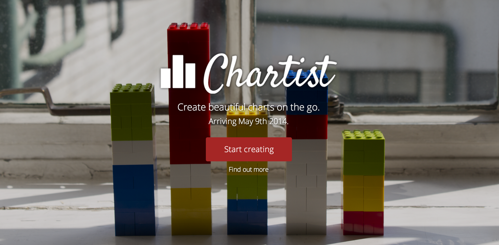

# Charti.st 
## Data visualization on the go

This project was built as our final submission for **[Makers Academy](http://www.makersacademy.com/)**. Chartist is a web application that provides a friendly and fast way to share information.

### The stack

* Ruby on Rails
* TDD with RSpec & FactoryGirl
* BDD with Capybara
* PostgreSQL
* External libraries: Chartkick, Google Charts API, Devise, Omniauth, Chronic, Roo, Paperclip, Zeroclipboard, Sendgrid
* JavaScript, jQuery, Angular.js, Handsontable.js, Gridster.js, Typeahead.js
* HTML5 & CSS3 using Twitter Boostrap

### The API

* Every chart is available in JSON format which we ourselves use to build charts. Just add .json to any chart link.

### Our process

During the 2 weeks we followed agile methodologies to ship code early and fast. We strongly believe in continuous deployment and fast prototyping.

We begin each day with a short 15-min meeting to assess the day's goals and then split for the rest of the day to work on several issues while keeping some extra time on the day to fix issues as they arise.

Our final project presented a learning opportunity for all of us, so we decided to pair on the most challenging features, like developing the **[Chart Feature](https://github.com/chartist/chartist/blob/master/app/models/chart.rb)**
with a proper test-suite that covered **[integration-testing](https://github.com/chartist/chartist/blob/master/spec/features/chart_feature_spec.rb)**, **[unit-testing](https://github.com/chartist/chartist/blob/master/spec/models/chart_spec.rb)**
and **[requests](https://github.com/chartist/chartist/blob/master/spec/requests/chart_request_spec.rb)**.

### What's next
As this was a 2-week project we focused on building the core funtionality. However, we belive there is a lot of potential to extend the project by implementing in-chart annotations, Google Spreadsheets integration, inbound API (building a chart from JSON messages) etc.

### The team

Chartist was well crafted with ♥

* Mario Gintili
* Mikhail Dubov
* Toby Retallick
* Anna Yanova
* Natascia Marchese
